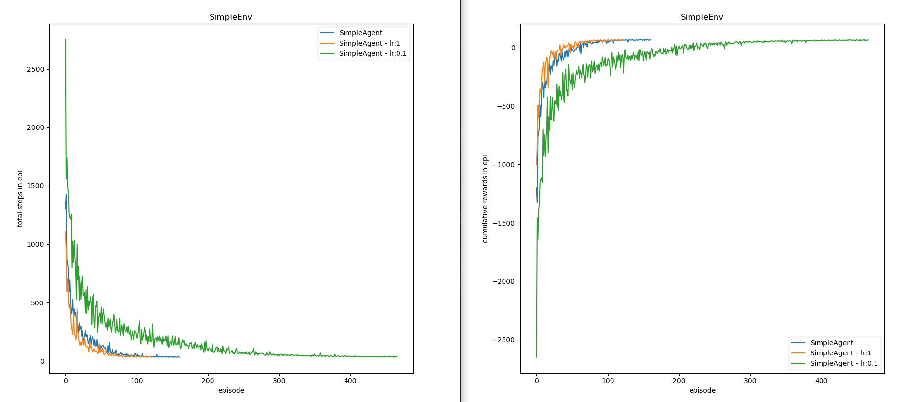

# RL Runner

> An easy to use and expand framework for Reinforcement Learning experimentation and run simulation

## About

I had some difficulty naming this project and ended up choosing RL runner, but some other options would be RL Agent runner, Agent comparator, RL Running System, Agent Running system, etc...

In the past I've wanted, both academically and for fun experimentations, to compare different RL agents with different parameters and different environments, but didn't find anything except gym, which only helped with environments. So I made my own system for performing runs with different agents and environments, adding other features along as I found necessary and useful. In the end it was a mess of code, but code that could be useful for other people that might need what I also needed. 

So, I wrote this RL running framework from the ground up with this in mind: as much freedom as possible for experimenting and doing what people want while providing a good foundation for building upon it.

I made this to be as whatever you might need as possible.

You can install as a library and quickly have a system for comparing some agents and experiment in RL, 
or even take the package from here, slam it in your project and redesign anything you want from it.

Sharing your work should also be simpler when both people use the same underlying system, no matter if it's an original agent, env or anything else.

In case you are a teacher you could even take this runner, or make one from it custom to your needs, and give your students a good foundation to build upon and learn. You can even directly compare their agents under the same rules and make fun competitions.

I hope this can be useful to people :)

## How it works

You create a runner object. You add agents, environments (and other things you might need) to the runner. You run the runner.

```python
from rlrunner.agents.simple_agent import SimpleAgent
from rlrunner.envs.simple_env import SimpleEnv
from rlrunner.termination.simple_tc import SimpleTC
from rlrunner.runner import Runner

runner = Runner()

runner.add_env(SimpleEnv())
runner.add_agent(SimpleAgent())

runner.set_termination_condition(SimpleTC())

run_thread = runner.do_it()
run_thread.join()
```

This is a simple example which simulates a SimpleAgent run in a SimpleEnv.

There are abstract classes (BaseAgent, BaseEnv, etc) for you to extend and then use.
For example, the SimpleAgent class is a simple Q-learning implementation that extends the abstract BaseAgent class.

BaseEnv also extends the gym.Env class, so any Env you make that extends the BaseEnv is also a gym env and any gym env should be compatible with the runner.
The SimpleEnv is a simple maze implementation with some potential for extension.

The Runner do_it() method also creates a new thread, which will simulate the run, and returns the thread. In case you want to have multiple runners doing simulations at the same time.

## More info

The runner will do a run simulation for each Agent/Env pair it has, e.g. above the only pair was SimpleAgent/SimpleEnv so only one run simulation, if another agent was added then 2 run simulations would be made, for SimpleAgent/SimpleEnv and TheOtherAgent/SimpleEnv.

A run simulation constitutes of 3 loops, the loop of runs which has the loop of episodes which then has the loop of steps:
* A step is one cycle of the simple RL loop.
* An episode is a loop of steps. Generally an episode ends when the agent reaches a goal or after X steps.
* A run is a loop of episodes. Generally a run ends after the agent is done learning the task/how to reach the goal or after X episodes.
* A run simulation is a loop of runs. A run simulation ends after X runs.

I only talked about 2 of the main 4 components (BaseAgent and BaseEnv) and will now discuss the other 2: the TerminationCondition and the StatSaver.

The TerminationCondition is necessary and it is the class that will decide when a run should end. This exists in order to allow for implementations that observe the agent's performance and dynamically decide when to end a run (when has an agent finish learning). The provided SimpleTC is a simple implementation that ends an episode after a set X number of episodes has passed. The provided DynamicTC is an example of a more complex implementation that stores information about the agent's learning progress to stop a run when it considers the agent has finished learning.

The StatSaver is optional but highly recommended. It's an utility class made for the purpose of facilitating the gathering, storing and visualization of information about the runs. The provided SimpleSS is a simple implementation that stores some agent information which can then be visualized at the end of the runs (with the help of matplotlib.pyplot).

For more info then the one provided here it's probably better to just read and learn from the documentation in the class files.

## A more useful example
A more useful and concrete example with just the provided classes.

```python
runner = Runner(number_of_runs=10)

runner.add_env(SimpleEnv())
runner.add_agent(SimpleAgent())

diff_agent = SimpleAgent()
diff_agent.name += " - lr:1"
diff_agent.learning_rate = 1
runner.add_agent(diff_agent)

diff_agent = SimpleAgent()
diff_agent.name += " - lr:0.1"
diff_agent.learning_rate = 0.1
runner.add_agent(diff_agent)

runner.set_termination_condition(DynamicTC())

runner.set_stat_saver(SimpleSS())

run_thread = runner.do_it()

run_thread.join()
runner.stat_saver.show_info()
```

This Runner will do 10 runs for each run simulation, and it will make 3 run simulations, one for each agent.
As such, 1 env and 3 agents were added to the runner, each agent being a SimpleAgent but with a different learning rate (default lr is 0.5).
The DynamicTC is used, so the runs will not end when a fixed episode number is reached.
The SimpleSS will collect the information of the runs and store it.
When all is done the SimpleSS will also present plots showing the average run of each agent, which can be seen below.


